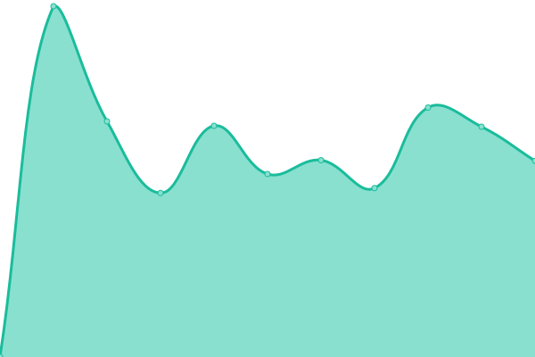
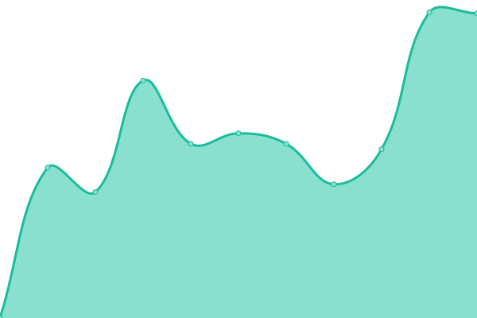
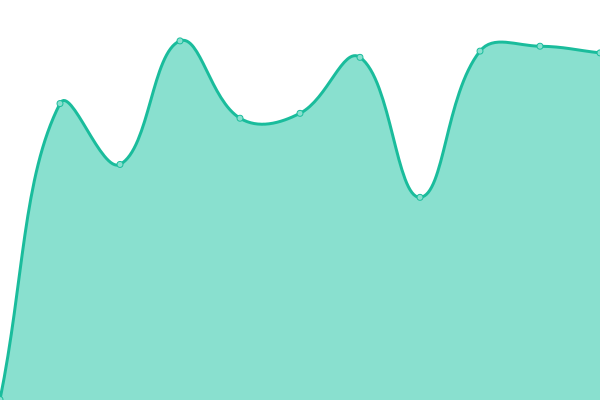
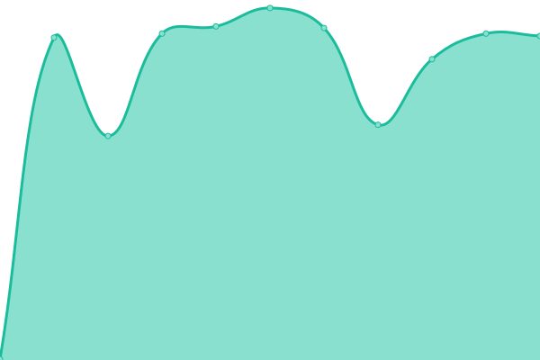

# [📈 Live Status](https://kt-chelsea.github.io/status/): <!--live status--> **🟥 Complete outage**

This repository contains the open-source uptime monitor and status page for [kt-chelsea](https://kt-chelsea.github.io/status/), powered by [Upptime](https://github.com/upptime/upptime).

With [Upptime](https://upptime.js.org), you can get your own unlimited and free uptime monitor and status page, powered entirely by a GitHub repository. We use [Issues](https://github.com/kt-chelsea/status/issues) as incident reports, [Actions](https://github.com/kt-chelsea/status/actions) as uptime monitors, and [Pages](https://kt-chelsea.github.io/status/) for the status page.

<!--start: status pages-->
<!-- This summary is generated by Upptime (https://github.com/upptime/upptime) -->
<!-- Do not edit this manually, your changes will be overwritten -->

| URL                                                              | Status  | History                                                                                                        | Response Time                                                                            | Uptime                                                                                                                                                                                                                                     |
| ---------------------------------------------------------------- | ------- | -------------------------------------------------------------------------------------------------------------- | ---------------------------------------------------------------------------------------- | ------------------------------------------------------------------------------------------------------------------------------------------------------------------------------------------------------------------------------------------ |
| [Chelsea](http://chelsea.kt.co.kr)                               | 🟥 Down | [chelsea.yml](https://github.com/kt-chelsea/status/commits/master/history/chelsea.yml)                         |  525ms             |                           |
| [KTDN](http://ktdn.chelsea.kt.co.kr)                             | 🟥 Down | [ktdn.yml](https://github.com/kt-chelsea/status/commits/master/history/ktdn.yml)                               |  520ms                |                                 |
| [Gitlab](http://scm.chelsea.kt.co.kr)                            | 🟥 Down | [gitlab.yml](https://github.com/kt-chelsea/status/commits/master/history/gitlab.yml)                           |  676ms              |                             |
| [Orchestra](http://issue.chelsea.kt.co.kr)                       | 🟥 Down | [orchestra.yml](https://github.com/kt-chelsea/status/commits/master/history/orchestra.yml)                     |  1448ms          |                       |
| [Nexus](http://repo.chelsea.kt.co.kr)                            | 🟥 Down | [nexus.yml](https://github.com/kt-chelsea/status/commits/master/history/nexus.yml)                             |  422ms               |                               |
| [Jenkins](http://build.chelsea.kt.co.kr)                         | 🟥 Down | [jenkins.yml](https://github.com/kt-chelsea/status/commits/master/history/jenkins.yml)                         |  455ms             |                           |
| [Ansible](http://deploy.chelsea.kt.co.kr/#/login)                | 🟥 Down | [ansible.yml](https://github.com/kt-chelsea/status/commits/master/history/ansible.yml)                         |  472ms             |                           |
| [MatterMost](http://chat.chelsea.kt.co.kr/login)                 | 🟥 Down | [matter-most.yml](https://github.com/kt-chelsea/status/commits/master/history/matter-most.yml)                 |  416ms         |                   |
| [Xwiki](http://wiki.chelsea.kt.co.kr/xwiki/bin/view/Main/)       | 🟥 Down | [xwiki.yml](https://github.com/kt-chelsea/status/commits/master/history/xwiki.yml)                             |  627ms               |                               |
| [Chelsea Product API](http://chelsea.kt.co.kr/chelsea/product)   | 🟥 Down | [chelsea-product-api.yml](https://github.com/kt-chelsea/status/commits/master/history/chelsea-product-api.yml) |  280ms |   |
| [Chelsea Project API](http://chelsea.kt.co.kr/chelsea/project)   | 🟥 Down | [chelsea-project-api.yml](https://github.com/kt-chelsea/status/commits/master/history/chelsea-project-api.yml) |  142ms |  |
| [KTDN Article API](http://ktdn.chelsea.kt.co.kr/api/v1/articles) | 🟥 Down | [ktdn-article-api.yml](https://github.com/kt-chelsea/status/commits/master/history/ktdn-article-api.yml)       |  2022ms   |        |

<!--end: status pages-->

[**Visit our status website →**](https://kt-chelsea.github.io/status/)

## 📄 License

- Code: [MIT](./LICENSE) © [kt-chelsea](https://kt-chelsea.github.io/status/)
- Data in the `./history` directory: [Open Database License](https://opendatacommons.org/licenses/odbl/1-0/)
