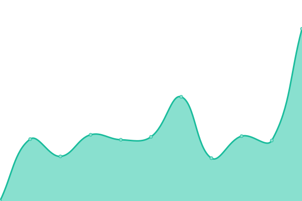
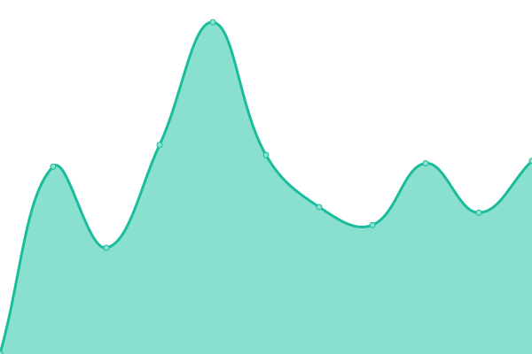
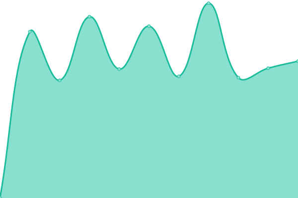
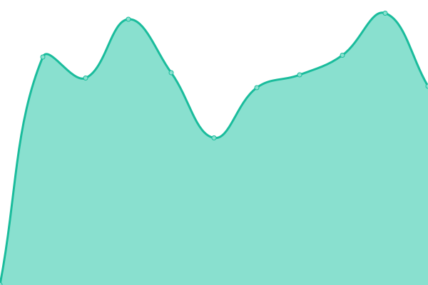

# [📈 Live Status](https://kt-chelsea.github.io/status/): <!--live status--> **🟩 All systems operational**

This repository contains the open-source uptime monitor and status page for [kt-chelsea](https://kt-chelsea.github.io/status/), powered by [Upptime](https://github.com/upptime/upptime).

With [Upptime](https://upptime.js.org), you can get your own unlimited and free uptime monitor and status page, powered entirely by a GitHub repository. We use [Issues](https://github.com/kt-chelsea/status/issues) as incident reports, [Actions](https://github.com/kt-chelsea/status/actions) as uptime monitors, and [Pages](https://kt-chelsea.github.io/status/) for the status page.

<!--start: status pages-->
<!-- This summary is generated by Upptime (https://github.com/upptime/upptime) -->
<!-- Do not edit this manually, your changes will be overwritten -->
<!-- prettier-ignore -->
| URL | Status | History | Response Time | Uptime |
| --- | ------ | ------- | ------------- | ------ |
| [Chelsea](http://chelsea.kt.co.kr) | 🟩 Up | [chelsea.yml](https://github.com/kt-chelsea/status/commits/master/history/chelsea.yml) | 

 749ms
     
 | 

   

| [KTDN](http://ktdn.chelsea.kt.co.kr) | 🟩 Up | [ktdn.yml](https://github.com/kt-chelsea/status/commits/master/history/ktdn.yml) | 

 698ms
     
 | 

   

| [Gitlab](http://scm.chelsea.kt.co.kr) | 🟩 Up | [gitlab.yml](https://github.com/kt-chelsea/status/commits/master/history/gitlab.yml) | 

 955ms
     
 | 

   

| [Orchestra](http://issue.chelsea.kt.co.kr) | 🟩 Up | [orchestra.yml](https://github.com/kt-chelsea/status/commits/master/history/orchestra.yml) | 

 2076ms
     
 | 

   

| [Nexus](http://repo.chelsea.kt.co.kr) | 🟩 Up | [nexus.yml](https://github.com/kt-chelsea/status/commits/master/history/nexus.yml) | 

 622ms
     
 | 

   

| [Jenkins](http://build.chelsea.kt.co.kr) | 🟩 Up | [jenkins.yml](https://github.com/kt-chelsea/status/commits/master/history/jenkins.yml) | 

 630ms
     
 | 

   

| [Ansible](http://deploy.chelsea.kt.co.kr/#/login) | 🟩 Up | [ansible.yml](https://github.com/kt-chelsea/status/commits/master/history/ansible.yml) | 

 650ms
     
 | 

   

| [MatterMost](http://chat.chelsea.kt.co.kr/login) | 🟩 Up | [matter-most.yml](https://github.com/kt-chelsea/status/commits/master/history/matter-most.yml) | 

 600ms
     
 | 

   

| [Xwiki](http://wiki.chelsea.kt.co.kr/xwiki/bin/view/Main/) | 🟩 Up | [xwiki.yml](https://github.com/kt-chelsea/status/commits/master/history/xwiki.yml) | 

 822ms
     
 | 

   

| [Chelsea Product API](http://chelsea.kt.co.kr/chelsea/product) | 🟩 Up | [chelsea-product-api.yml](https://github.com/kt-chelsea/status/commits/master/history/chelsea-product-api.yml) | 

 367ms
     
 | 

   

| [Chelsea Project API](http://chelsea.kt.co.kr/chelsea/project) | 🟩 Up | [chelsea-project-api.yml](https://github.com/kt-chelsea/status/commits/master/history/chelsea-project-api.yml) | 

 191ms
     
 | 

   

| [KTDN Article API](http://ktdn.chelsea.kt.co.kr/api/v1/articles) | 🟩 Up | [ktdn-article-api.yml](https://github.com/kt-chelsea/status/commits/master/history/ktdn-article-api.yml) | 

 2665ms
     
 | 

   

<!--end: status pages-->

[**Visit our status website →**](https://kt-chelsea.github.io/status/)

## 📄 License

- Code: [MIT](./LICENSE) © [kt-chelsea](https://kt-chelsea.github.io/status/)
- Data in the `./history` directory: [Open Database License](https://opendatacommons.org/licenses/odbl/1-0/)
